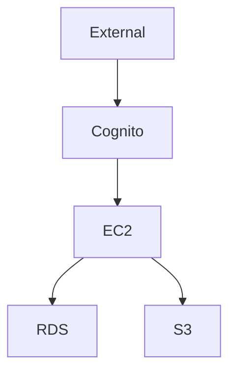
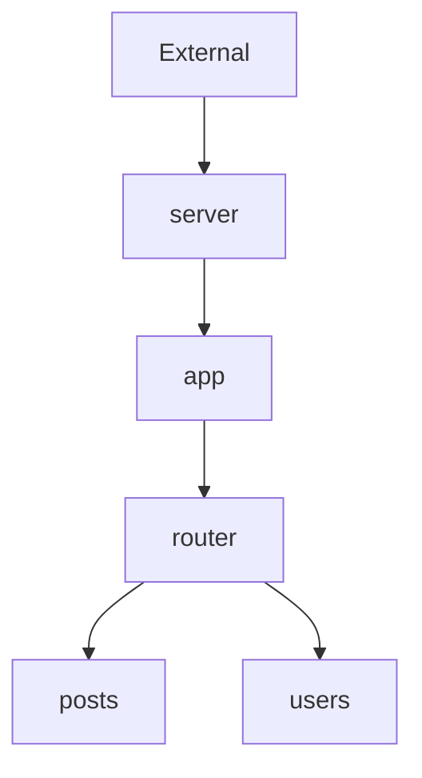
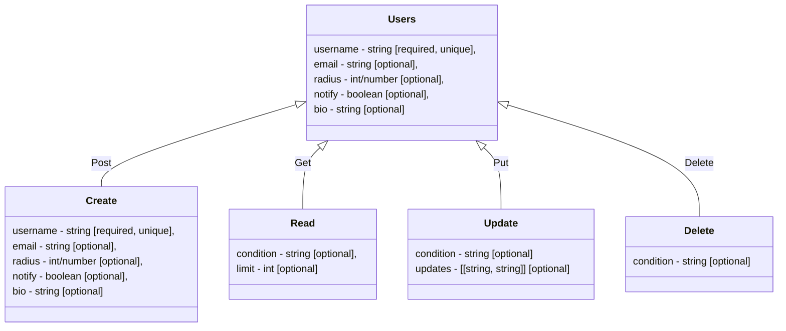
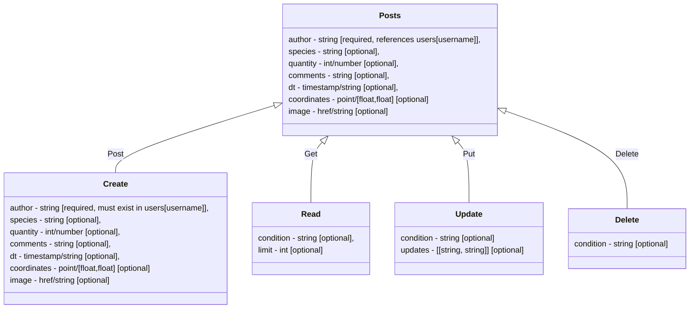
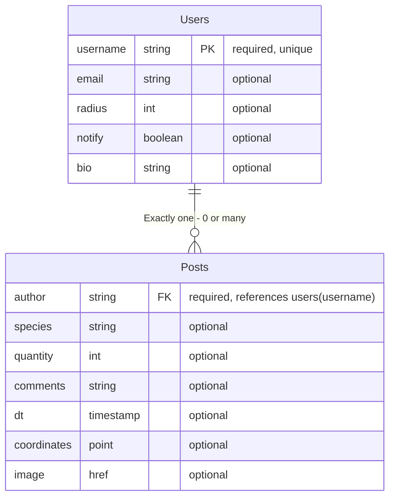
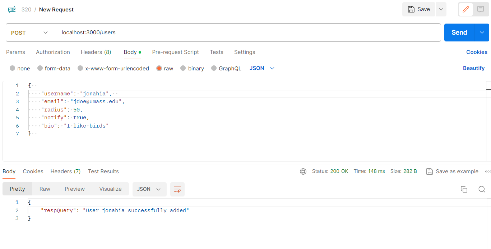
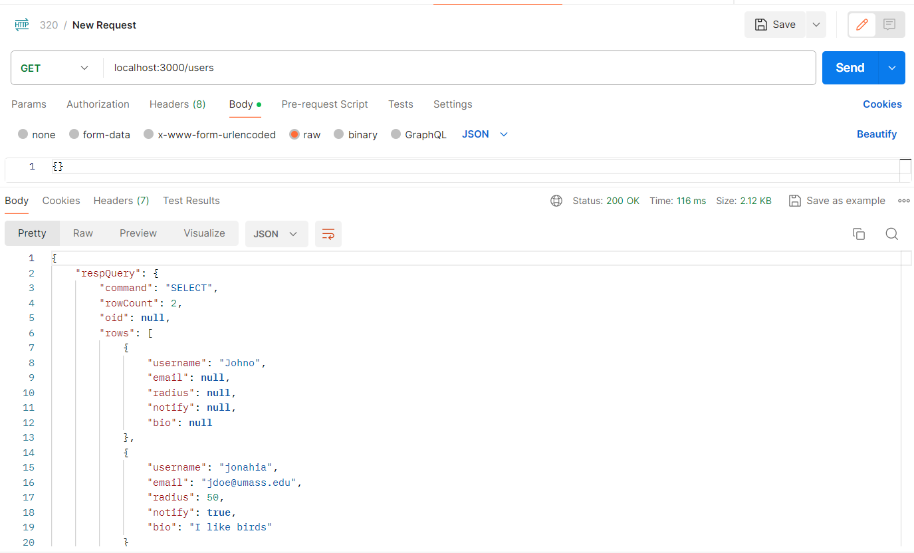

# Diagrams

### AWS 



### Requests Chain


### Endpoints
#### Users


#### Posts


Notes:  
dt format is "YYYY-MM-DD HH:MM:SS"  
coordinate format is [latitude,longitude]
updates format is [[field1,newVal1], [field2,newVal2] ... [fieldN,newValN]]

### ER Diagram



#### HOW TO USE
 - Use endpoint from: host/posts, host/users
 - Use method from: Create/POST, Read/GET, Update/PUT, Delete/DELETE
 - Use JSON body with names and types that correspond to the selected endpoint and method

#### Examples

To create a user:
 - Endpoint = host/users
 - Method = Create/Post
 - JSON body = 
 ```
{
    username - string [required, unique],  
    email - string [optional],
    radius - int/number [optional],
    notify - boolean [optional],
    bio - string [optional]
}
```
 - Example body = 
  ```
  {
    "username": "jonahia",
    "email": "jdoe@umass.edu",
    "radius": 50,
    "notify": true,
    "bio": "I like birds"
  }
  ```
 - Example shown through Postman API:
  

To read a user:
 - Endpoint = host/users
 - Method = Read/Get
 - JSON body = 
 ```
 {
    "condition" = ""
 }
 ```
 - Example body = ```{}```
 - Example shown through Postman API:
 