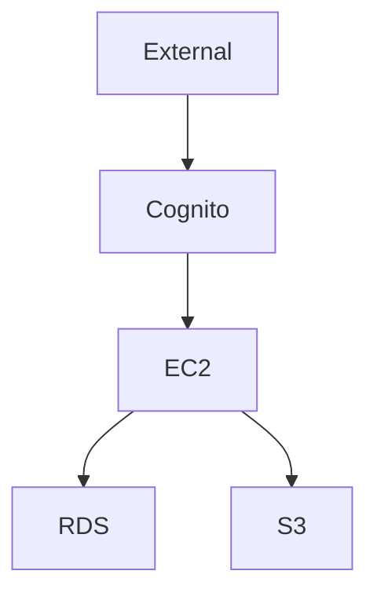
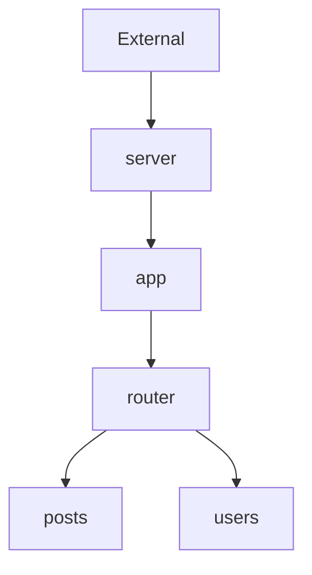
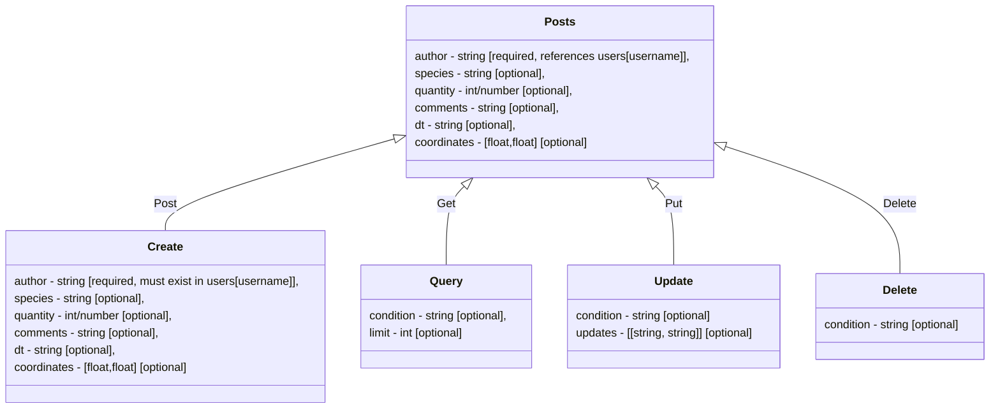

# Diagrams

### AWS 

### Requests Chain

### Endpoints
#### Users

#### Posts

Notes:  
dt format is "YYYY-MM-DD HH:MM:SS"  
coordinate format is [latitude,longitude]
updates format is [[field1,newVal1], [field2,newVal2] ... [fieldN,newValN]]

#### HOW TO USE
 - Use endpoint from: host/posts, host/users
 - Use method from: POST, GET, PUT, DELETE
 - Use JSON body with names and types that correspond to the selected endpoint and method
