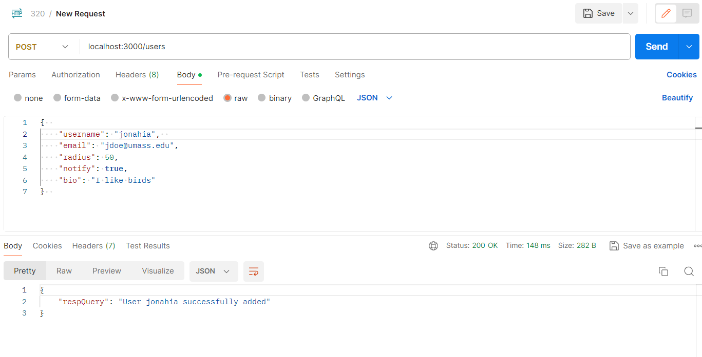

# USAGE

## HOW TO
 - Use endpoint from: host/posts, host/users, or host/dbTesting
 - Use method from: POST, GET, PUT, DELETE
 - Use JSON body with names and types that correspond to the selected endpoint and method
 - Formatted as...
### Endpoint
 - method
 ```
 {
    body
 }
 ```

## Endpoints, methods, and bodies

### host/posts:
 - POST (INSERT): 
```  
{  
    author: string (required, must exist in users(username)),  
    species: string (optional),  
    quantity: number (optional),  
    comments: string (optional),  
    dt: _ (optional), 
    coordinate: _ (optional)
} TODO - still working out what json datatypes correspond to the sql datatypes for timestamp and coordinate
```  
 - GET (SELECT):
 ```
 {
    condition: string (optional),
    limit: int (optional)
 } TODO - fix so don't need the single quotes around strings like "condition": "email = 'jdoe@umass.edu'"
 ```
 - PUT (UPDATE):
 ```
 {
    condition: string (optional),
    updates: [
        [param, newVal], (optional)
        [param, newVal], (optional)
        [param, newVal] (optional)
    ] (optional)
 }
 ```
 - DELETE (DELETE):
 ```
 {
    condition: string (optional)
 }
 ```

### host/users: 
 - POST (INSERT):
```  
{  
    username: string (required, unique),  
    email: string (optional),
    radius: int/number (optional),
    notify: boolean (optional),
    bio: string (optional)
}  
```  
 - GET (SELECT):
 ```
 {
    condition: string (optional),
    limit: int (optional)
 } TODO - fix so don't need the single quotes around strings like "condition": "email = 'jdoe@umass.edu'"
 ```
 - PUT (UPDATE):
 ```
 {
    condition: string (optional),
    updates: [
        [param, newVal], (optional)
        [param, newVal], (optional)
        [param, newVal] (optional)
    ] (optional)
 }
 ```
 - DELETE (DELETE):
 ```
 {
    condition: string (optional)
 }
 ```

### host/dbTesting:
 - GET (any):
 ```
 {
    "query": string (required)
 }
 ```

 ## Example
 