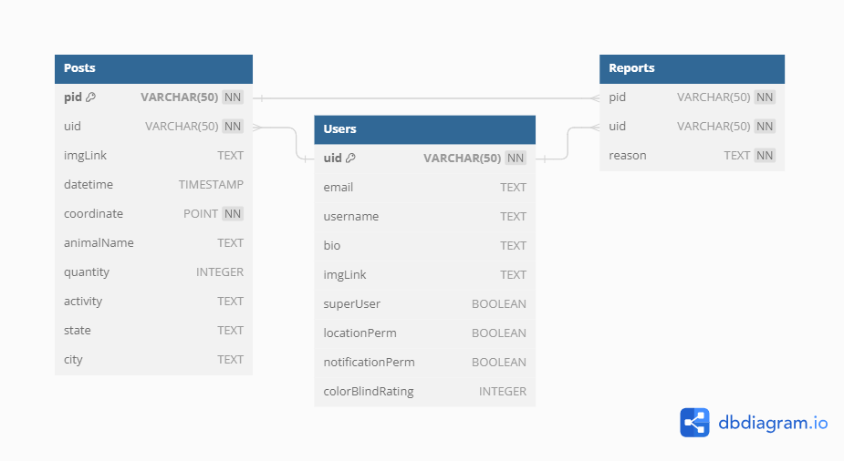

# WildWhere

## Webpage: https://sites.google.com/umass.edu/wildwhere/home

## Frontend

### Build Process

#### Introduction

This README provides instructions on how to find the WildWhere project’s build system, check out its source files, and build them. Please note that these instructions pertain to the frontend.

#### Build System Setup

1. ##### Prerequisities
      - In order to successfully run the project, the following tools need to be installed:
         - Install Flutter & OS Specific IDE: https://docs.flutter.dev/get-started/install
            - Select your development platform
            - If your platform is macOS, choose iOS; If your platform is Windows, choose Android
            - Follow the corresponding installation steps to download the Flutter SDK
              - Important (MacOS): Ensure you have added Flutter to the PATH environment variable in order to use Flutter commands in                   the Terminal https://www.codecademy.com/article/install-flutter-sdk-for-mac
              - Important (Windows): Ensure you have added Flutter to the PATH environment variable in order to use Flutter commands
                 in the Terminal https://www.liquidweb.com/kb/how-to-install-and-configure-flutter-sdk-windows-10/ (step 3)
      - Check your development setup by running the “flutter doctor” command in your terminal. You do not need both development kits            for both operating systems. For example, this is a valid output for MacOS:
        
         
   
3. ##### Clone the Github Repository

4. ##### Build and Run the Application
   
      - Using your terminal, cd into “/Wildwhere-main/frontend/wildwhere”
      - Begin a simulator either through XCode or AndroidStudio
      - Run “flutter devices” and copy the device id of the simulator
      - Run “flutter run -d DEVICEID” to build and run the application
      - Example build and run process on MacOS using XCode simulator:
   
         

### Testing

- Clone the GitHub repository and save the project to your preferred folder.
- For VSCode:
  - Open the `database_test.dart` file.
  - Go to Run > Start Debugging. You can also press the appropriate keyboard shortcut for your platform.
- To run tests in the terminal:
  - Run the following command from the root of the project: `flutter test test/database_test.dart`


## Backend

### Backend Onboarding

#### Setup

1. ##### Installing prerequisites
    - To install Git, see here: https://git-scm.com/downloads.
    - To install Node.js:
      - Download nvm by following the instructions here: https://github.com/nvm-sh/nvm.
      - Run `nvm install node`.
    - To install PostgreSQL, see here: https://www.postgresql.org/download/.

2. ##### Local database setup
    - Run `psql` to open the PostgreSQL command line.
    - Run `CREATE DATABASE wildwhere;`. Then run `\c wildwhere` to connect to the new database.
    - Copy and paste the contents of genTables.sql (located in this Github repository) into the command line and hit enter. This should create three tables, which you can view with `\dt`.
    - Type `\q` to quit psql.

3. ##### Local repository setup
    - In a folder of your choice, run `git clone https://github.com/amandeepksingh/WildWhere.git`. Then run `cd Wildwhere`.
    - Create a file called .env in the WildWhere directory containing the following:
      ```bash
      location="local"
      dbUser="postgres"
      dbPass="<postgres password>"
      dbHost="localhost"
      dbName="wildwhere"
      dbPort="5432"
      ec2port="80"
      # Amazon S3 keys
      accessPoint="<secret>"
      accessKeyID="<secret>"
      secretAccessKey="<secret>"
      ```
      If you don't know what your Postgres password is, you can reset it by running `ALTER USER postgres PASSWORD '<new password>';` within psql.\
      The Amazon S3 keys are not totally necessary; they are required for the image-related endpoints, but not for the database-related endpoints. (If you are not part of the core WildWhere team and want to test the image-related endpoints locally, you will have to make your own [Amazon S3](https://aws.amazon.com/s3/) bucket or use something like [fake-s3](https://github.com/jubos/fake-s3).)
    - Move to the backend directory with `cd backend`.
    - Run `npm install --save` to install the dependencies.
    - You can now run the scripts listed in the package.json, such as `npm run start` (to run the server locally) and `npm run test` (to test the backend code).

#### Conventions
- In general, we do _not_ commit directly to the main branch.
- Branches should be named after the feature being added or the issue being fixed. 

#### Server location
The code will automatically detect that you are running on local and will resolve the server to localhost (or 127.0.0.1).

#### Deploying to a server
Normally ask a network admin and they will build your changes to a development server. Moreover, if your changes are merged into main the server should automatically deploy to development by the end of the day. However, if you are given access to the pipeline:
- Make sure your changes are merged to main, then manually build the pipeline. This will deploy to our development server. 
- Unless explicitly given permission, do not build to our production server.

### Backend API
To run against the backend API, use the host listed for the EC2. This varies since it changes every time it's started up, but right now it is ec2-13-58-233-86.us-east-2.compute.amazonaws.com

You can add endpoints such as _/users/createUser_ onto the end to reach different endpoints the backend has set up. Each endpoint will support some method (_Post_, _Get_, _Put_, or _Delete_) and accept some input JSON body. These are specified below.

After sending a request to an endpoint with a method and input JSON body, you'll receive a response.

#### Example

Then you could run a request to the endpoint _ec2Host/users/createUser_ that uses a _Post_ method and send _{uid: 582, username: John254}_ as its input JSON body.

##### In browser

- Navigate to https://reqbin.com/  
- Insert ec2-13-58-233-86.us-east-2.compute.amazonaws.com/users/createUser as the URL
- Specify POST as the method
- Insert {"username": "John"} as the JSON body
- Click Send

##### In Dart (frontend language)
```
import 'package:http/http.dart' as http;

void main() async {
  // Define the URL you want to request to
  var url = Uri.parse('http://ec2-3-138-136-228.us-east-2.compute.amazonaws.com/users/createUser');

  // Define your JSON payload
  Map<String, dynamic> jsonBody = {
    'username': 'John254'
  };

  // Convert the JSON payload to a string
  String jsonString = json.encode(jsonBody);

  // Make the POST request
  var response = await http.post(
    url,
    headers: <String, String>{
      'Content-Type': 'application/json; charset=UTF-8',
    },
    body: jsonString,
  );
}
```

The request will return a response that has a status code and a message, which can be references as _response.statusCode_ and _response.message_, which will also vary depending on the endpoint, method, and input JSON body.

```
    print(response.statusCode) 
    //returns 200
    
    print(response.message) 
    //returns "user created"
```

### Description

#### User Description

_selecting users_: Used to select all users matching input JSON body and return an array of each of those users' attributes.  
Requests accepted by URL-encoded query
| Endpoint | Method | Input JSON body | Input JSON Param optional/required | response status code | response message |  
| :-------: | :----: | :-------------: | :---: |  :------------------: | :---------------: |
| _ec2Host/users/selectUser_ | _get_ | _JSON body of following_ | _optional or required_ | _200_ | _array of JSON bodies of following_ |
| :-------: | :----: | :-------------: | :------------------: | :---------------: | :---: |
||| uid string | optional || uid string
||| email string | optional || email string
||| username string | optional || username string
||| bio string | optional || bio string
||| imgLink string | optional || imglink string
||| superUser boolean | optional || superuser boolean
||| locationPerm boolean | optional || locationperm boolean
||| notificationPerm boolean | optional || notificationperm boolean
||| colorBlindRating int | optional || colorblindrating int

_creating users_: Used to create user with attributes matching the input JSON body.  
Requests accepted by JSON-body encoded request
| Endpoint | Method | Input JSON body | Input JSON Param optional/required | response status code | response message |  
| :-------: | :----: | :-------------: | :-------------: | :------------------: | :---------------: |
| _ec2Host/users/createUser_ | _post_ | _JSON body of following_ | _optional or required_ | _200_ | string |
| :-------: | :----: | :-------------: | :------------------: | :---------------: | :---: |
||| uid string | REQUIRED || user created
||| email string | optional || _or_
||| username string | optional || error message
||| bio string | optional || 
||| imgLink string | optional || 
||| superUser boolean | optional || 
||| locationPerm boolean | optional || 
||| notificationPerm boolean | optional || 
||| colorBlindRating int | optional || 

_updating users_: Used to update user with given UID so the match the input JSON body.  
Requests accepted by JSON-body encoded request
| Endpoint | Method | Input JSON body | Input JSON Param optional/required | response status code | response message |  
| :-------: | :----: | :-------------: | :-------------: | :------------------: | :---------------: |
| _ec2Host/users/updateUserByUID_ | _put_ | _JSON body of following_ | _optional or required_ | _200_ | string |
| :-------: | :----: | :-------------: | :------------------: | :---------------: | :---: |
||| uid string | REQUIRED || user with uid ${uid} updated
||| email string | optional || _or_
||| username string | optional || error message
||| bio string | optional || 
||| imgLink string | optional || 
||| superUser boolean | optional || 
||| locationPerm boolean | optional || 
||| notificationPerm boolean | optional || 
||| colorBlindRating int | optional || 

_deleting users_: Used to delete user with given UID.  
Requests accepted by URL-encoded query
| Endpoint | Method | Input JSON body | Input JSON Param optional/required | response status code | response message |  
| :-------: | :----: | :-------------: | :------------------: | :---------------: | :---------------: |
| _ec2Host/users/deleteUserByUID_ | _delete_ | _JSON body of following_ | _optional or required_ | _200_ | string
| :-------: | :----: | :-------------: | :------------------: | :-------------: | :---------------: |
||| uid string | requried || user with uid ${uid} deleted if existed
|||||| _or_ 
|||||| error message


#### Post Description

_selecting posts_: Used to select all posts matching input JSON body and return an array of each of those posts' attributes.  
Requests accepted by URL-encoded query
| Endpoint | Method | Input JSON body | Input JSON Param optional/required | response status code | response message |  
| :-------: | :----: | :-------------: | :---: |  :------------------: | :---------------: |
| _ec2Host/posts/selectPost_ | _get_ | _JSON body of following_ | _optional or required_ | _200_ | _array of JSON bodies of following_ |
| :-------: | :----: | :-------------: | :------------------: | :---------------: | :---: |
||| pid string | optional || pid string
||| uid string | optional || uid string
||| radius int | optional || radius int 
||| imgLink string | optional || imglink string
||| starttime timestamp YYYY/MM/DD/HH24/MI/ss | optional || starttime timestamp
||| endtime timestamp YYYY/MM/DD/HH24/MI/ss | optional || endtime timestamp
||| coordinate point (longitude [-180, 180], latitude [-90, 90]) e.g. (-169.2, 25.0) | optional (required for non-null radius) || coordinate point
||| animalName []string | optional || animalname string
||| quantity []int | optional || quantity int
||| activity []string | optional || activity string
||| city []string | optional || city string
||| state []string | optional || state string


_creating posts_: Used to create post with attributes matching the input JSON body.  
Requests accepted by JSON-body encoded request
| Endpoint | Method | Input JSON body | Input JSON Param optional/required | response status code | response message |  
| :-------: | :----: | :-------------: | :-------------: | :------------------: | :---------------: |
| _ec2Host/posts/createPost_ | _post_ | _JSON body of following_ | _optional or required_ | _200_ | string |
| :-------: | :----: | :-------------: | :------------------: | :---------------: | :---: |
||| pid string | AUTO-GENERATED (random) || post created
||| uid string | REQUIRED || _or_
||| imgLink string | optional || error message
||| datetime timestamp YYYY-MM-DD HH:MM:SS | optional ||
||| coordinate point (longitude [-180, 180], latitude [-90, 90]) e.g. (-169.2, 25.0) | REQUIRED ||
||| animalName string | optional ||
||| quantity int | optional ||
||| activity string | optional ||
||| city string | optional ||
||| state string | optional ||

_updating posts_: Used to update post with given PID so the match the input JSON body.  
Requests accepted by JSON-body encoded request
| Endpoint | Method | Input JSON body | Input JSON Param optional/required | response status code | response message |  
| :-------: | :----: | :-------------: | :-------------: | :------------------: | :---------------: |
| _ec2Host/posts/updatePostByPID_ | _put_ | _JSON body of following_ | _optional or required_ | _200_ | string |
| :-------: | :----: | :-------------: | :------------------: | :---------------: | :---: |
||| pid string | REQUIRED || post with pid ${pid} updated
||| uid string | optional || _or_
||| imgLink string | optional || error message
||| datetime timestamp | optional ||
||| coordinate point | optional ||
||| animalName string | optional ||
||| quantity int | optional ||
||| activity string | optional ||
||| city string | optional ||
||| state string | optional ||

_deleting posts_: Used to delete post with given PID.  
Requests accepted by URL-encoded query
| Endpoint | Method | Input JSON body | Input JSON Param optional/required | response status code | response message |  
| :-------: | :----: | :-------------: | :------------------: | :---------------: | :---------------: |
| _ec2Host/posts/deletePostByPID_ | _delete_ | _JSON body of following_ | _optional or required_ | _200_ | string
| :-------: | :----: | :-------------: | :------------------: | :-------------: | :---------------: |
||| pid string | REQUIRED || user with pid ${pid} deleted if existed
|||||| _or_
|||||| error message

### Images

#### User Images

_uploading images_: Used to upload images  
Requests accepted by form-data encoded request
| Endpoint | Method | Input JSON body | Input JSON Param optional/required | response status code | response message |  
| :-------: | :----: | :-------------: | :------------------: | :---------------: | :---------------: |
| _ec2Host/images/userProfilePic/upload_ | _post_ | _JSON body of following_ | _optional or required_ | _200_ | string
| :-------: | :----: | :-------------: | :------------------: | :-------------: | :---------------: |
||| uid int | REQUIRED || link to img
||| img image | REQUIRED || _or_
||| ||| error message


_deleting images_: Used to delete image (signed URLs become invalid)  
Requests accepted by URL-encoded query
| Endpoint | Method | Input JSON body | Input JSON Param optional/required | response status code | response message |  
| :-------: | :----: | :-------------: | :------------------: | :---------------: | :---------------: |
| _ec2Host/images/userProfilePic/delete_ | _delete_ | _JSON body of following_ | _optional or required_ | _200_ | string
| :-------: | :----: | :-------------: | :------------------: | :-------------: | :---------------: |
||| uid int | REQUIRED || 'image delete successful'
|||||| _or_
|||||| error message

#### Post Images

_uploading images_: Used to upload images  
Requests accepted by form-data encoded request
| Endpoint | Method | Input JSON body | Input JSON Param optional/required | response status code | response message |  
| :-------: | :----: | :-------------: | :------------------: | :---------------: | :---------------: |
| _ec2Host/images/postPic/upload_ | _post_ | _JSON body of following_ | _optional or required_ | _200_ | string
| :-------: | :----: | :-------------: | :------------------: | :-------------: | :---------------: |
||| pid int | REQUIRED || link to img
||| img image | REQUIRED || _or_
||| ||| error message


_deleting images_: Used to delete image (signed URLs become invalid)  
Requests accepted by URL-encoded query
| Endpoint | Method | Input JSON body | Input JSON Param optional/required | response status code | response message |  
| :-------: | :----: | :-------------: | :------------------: | :---------------: | :---------------: |
| _ec2Host/images/postPic/delete_ | _delete_ | _JSON body of following_ | _optional or required_ | _200_ | string
| :-------: | :----: | :-------------: | :------------------: | :-------------: | :---------------: |
||| pid int | REQUIRED || 'image delete successful'
|||||| _or_
|||||| error message


### Reports

_selecting reports_: Used to select reports  
Requests accepted by URL-encoded query
| Endpoint | Method | Input JSON body | Input JSON Param optional/required | response status code | response message |  
| :-------: | :----: | :-------------: | :------------------: | :---------------: | :---------------: |
| _ec2Host/reports/selectReport_ | _select_ | _JSON body of following_ | _optional or required_ | _200_ | array of JSON bodies of following
| :-------: | :----: | :-------------: | :------------------: | :-------------: | :---------------: |
||| pid string | optional || pid string
||| uid string | optional || uid string
||| reason string | optional || reason string

_posting reports_: Used to create reports  
Requests accepted by JSON-body encoded request
| Endpoint | Method | Input JSON body | Input JSON Param optional/required | response status code | response message |  
| :-------: | :----: | :-------------: | :------------------: | :---------------: | :---------------: |
| _ec2Host/reports/createReport_ | _post_ | _JSON body of following_ | _optional or required_ | _200_ | string
| :-------: | :----: | :-------------: | :------------------: | :-------------: | :---------------: |
||| pid string | REQUIRED || "report created successfully"
||| uid string | REQUIRED || _or_
||| reason string | REQUIRED || error message

### Database infrastructure

Our PostgreSQL database is hosted on RDS as a part of the AWS suite. We use an EC2 to interact with it and the tables we use in the database are shown below: 
